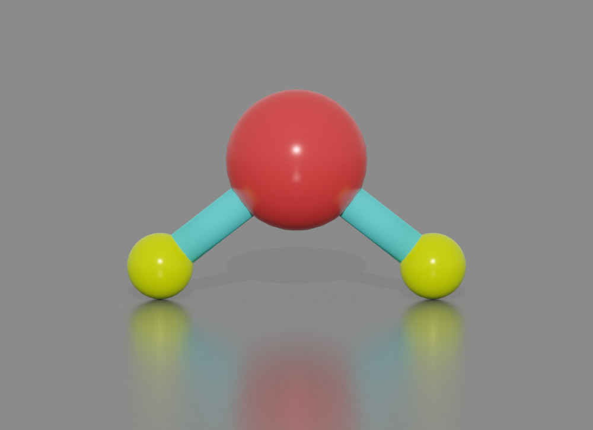
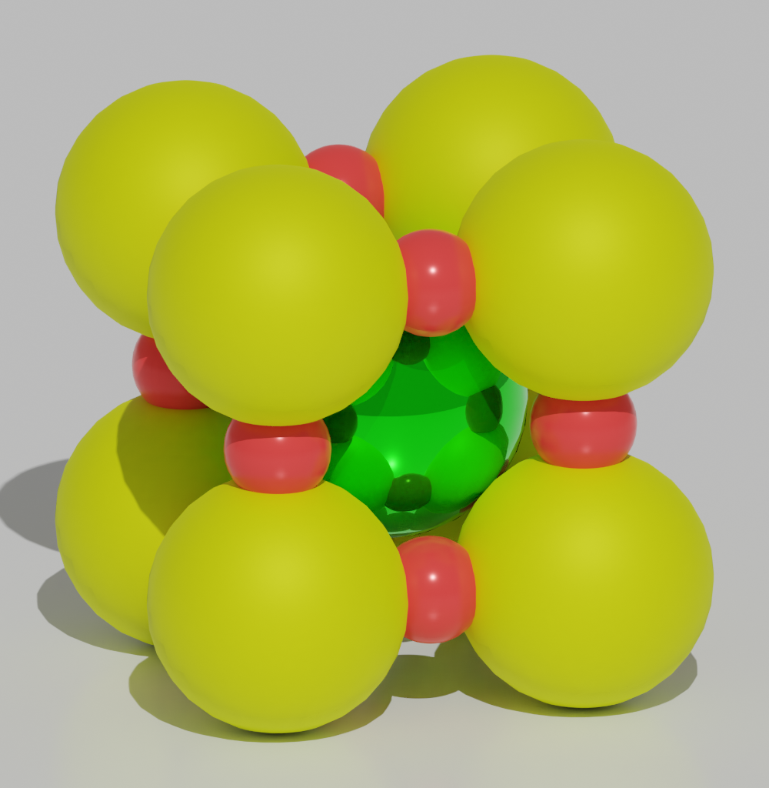
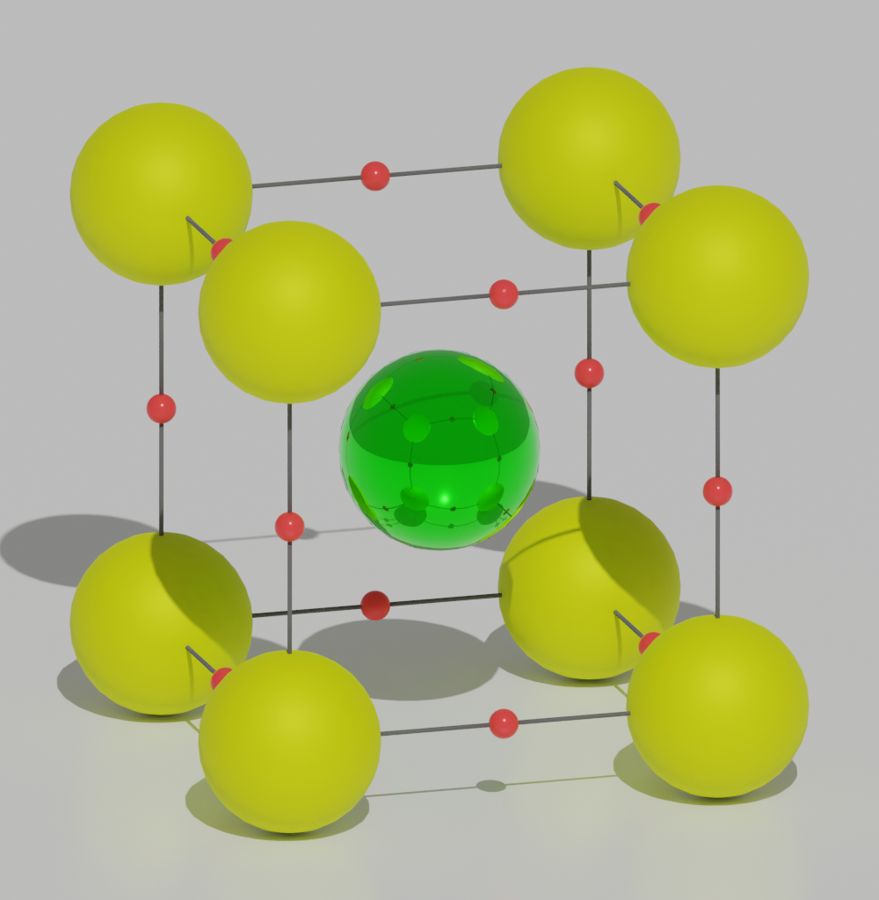
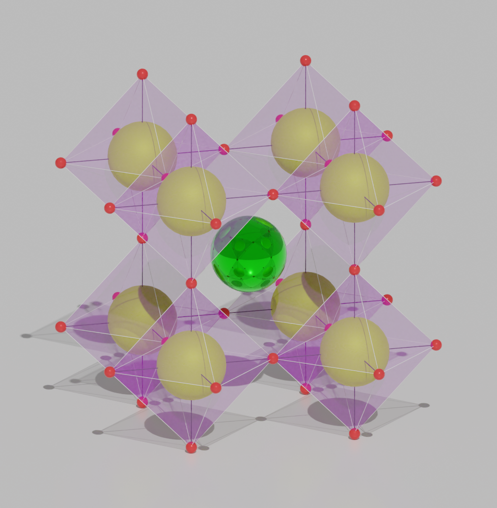
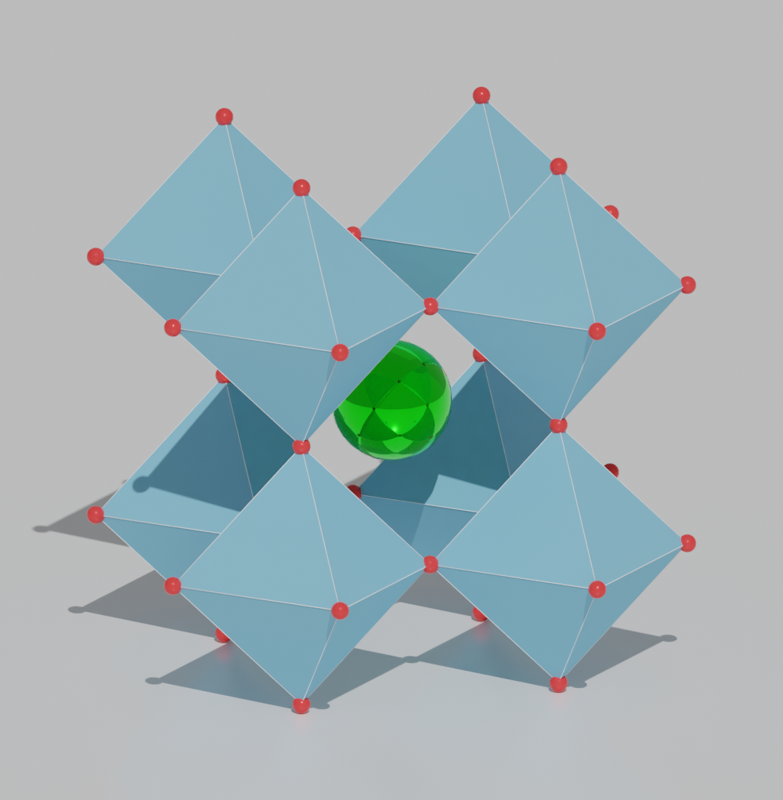
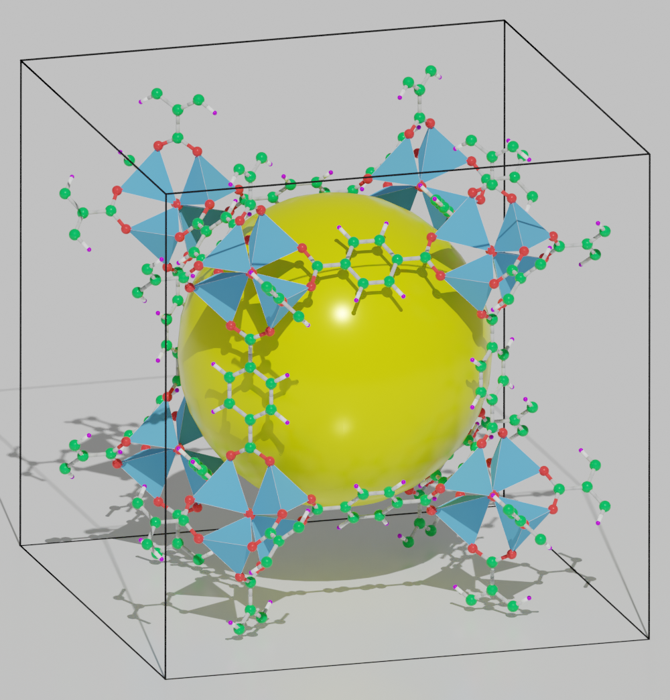
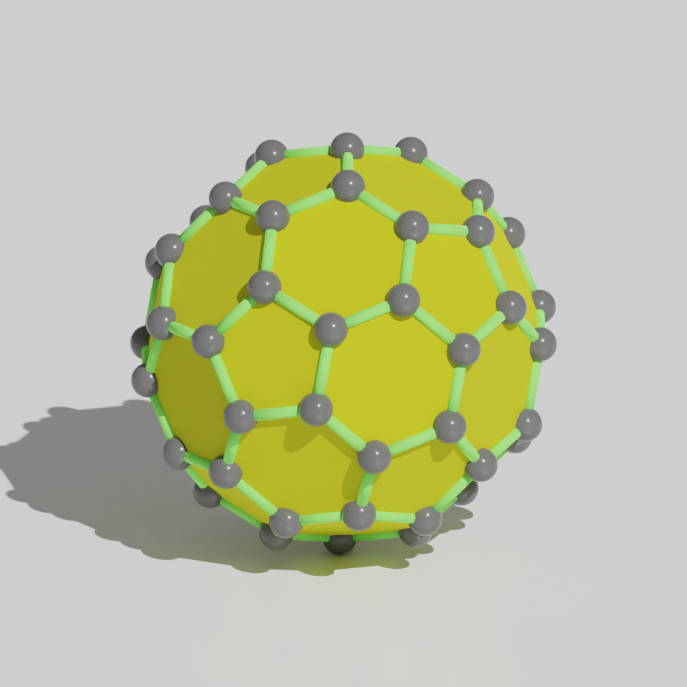
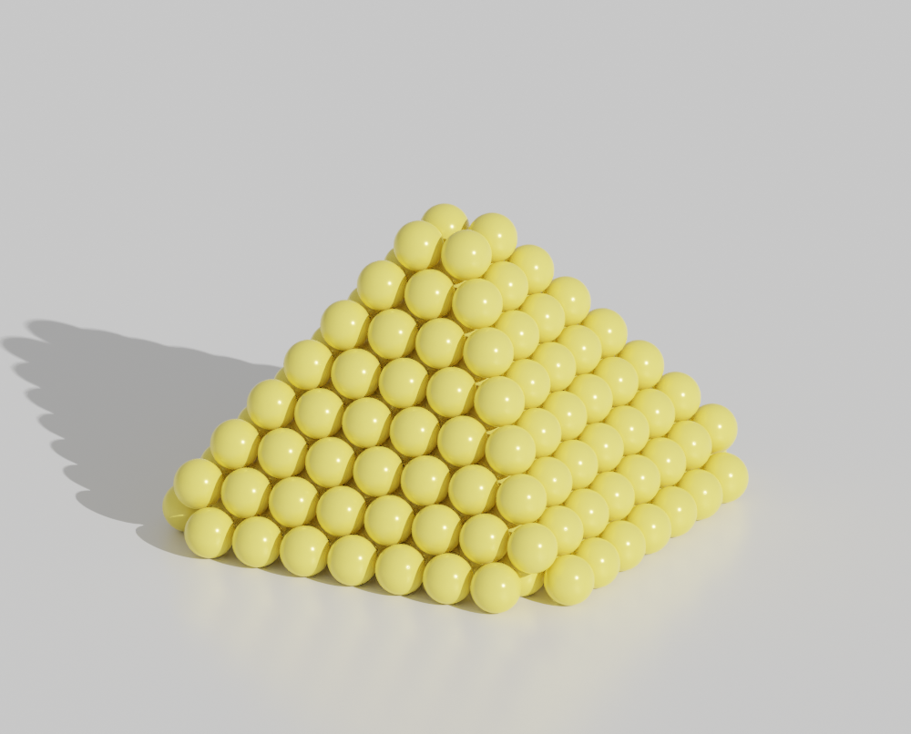
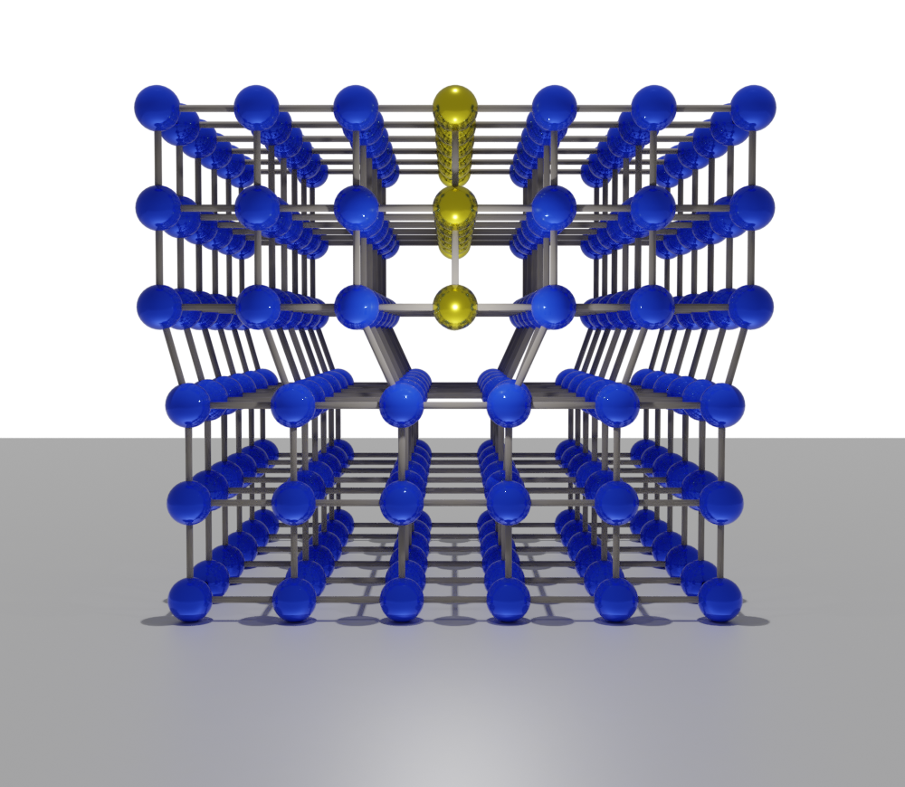
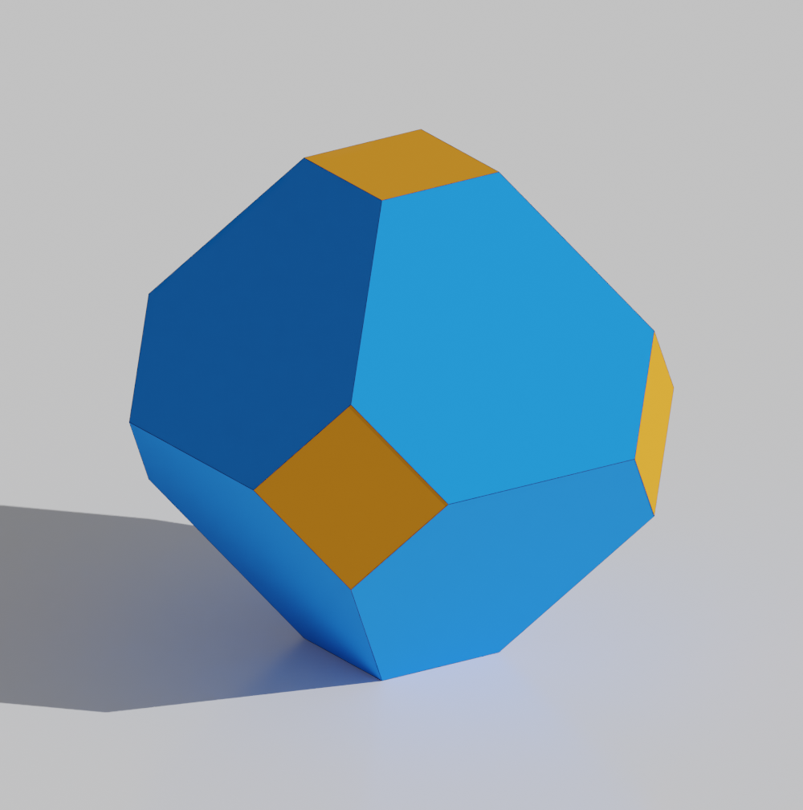

=========
Gallery
=========

Molecule
=============

.. list-table::
   :widths: 25 25

   * -  |h2o0|
     -  |h2o1|

.. |h2o0|  image:: _static/figs/gallery_h2o_ball.png
   :width: 8cm

:download:`gallery_molecule.py <_static/gallery_molecule.py>`

Crystal
============

Perovskite
-------------------

.. list-table::
   :widths: 25 25

   * -  |catio30|
     -  |catio31|
   * -  |catio32|
     -  |catio33|

:download:`gallery_crystal.py <_static/gallery_catio3.py>`

MOF
-------------------

:download:`gallery_cavity.py <_static/gallery_cavity.py>`

Nano
==========

C60
-------------------

:download:`gallery_c60.py <_static/gallery_c60.py>`

Nanoparticle
---------------------

:download:`gallery_wulff.py <_static/gallery_wulff.py>`

Defect
==============

Dislocation
-----------------------

:download:`gallery_dislocation.py <_static/gallery_dislocation.py>`

Vacancy
------------------------

.. image:: _static/figs/vacancy-au111-cycles.png
   :width: 10cm

:download:`gallery_vacancy.py <_static/gallery_vacancy.py>`

Lattice plane
==============

.. image:: _static/figs/gallery_planesetting_plane.png
   :width: 10cm

:download:`gallery_lattice_plane.py <_static/gallery_lattice_plane.py>`

Crystal shape
==============

:download:`gallery_crystal_shape.py <_static/gallery_crystal_shape.py>`

View
===========

.. list-table::
   :widths: 25 25 25

   * - Top View
     - Side View
     - Perspective View
   * -  |surface1|
     -  |surface2|
     -  |surface3|

:download:`surface.py <_static/surface.py>`

Model type
==========

.. list-table::
   :widths: 25 25 25 25

   * - Space-filling
     - Ball-and-stick
     - Polyhedral
     - Wireframe
   * -  |crystal1|
     -  |crystal2|
     -  |crystal3|
     -  |crystal4|

:download:`cyrstal.py <_static/batoms_model_type.py>`

Isosurface
============

.. image:: _static/figs/volume_h2o.png
   :width: 10cm

:download:`volume_h2o.py <_static/volume_h2o.py>`

Animation
============

.. image:: _static/figs/animation_c2h6so.gif
   :width: 10cm

:download:`animation.py <_static/animation.py>`

Motion blur
-------------

.. image:: _static/figs/motion_blur_h2o.png
   :width: 10cm

:download:`motion_blur_h2o.py <_static/motion_blur_h2o.py>`

Others
============

.. image:: _static/figs/monolayer.png
   :width: 10cm

.. |surface1|  image:: _static/figs/gallery_top_view.png 
   :width: 8cm
.. |surface2|  image:: _static/figs/gallery_side_view.png 
   :width: 8cm
.. |surface3|  image:: _static/figs/gallery_persp_view.png 
   :width: 8cm

.. |crystal1|  image:: _static/figs/batoms_model_type_0.png 
   :width: 8cm
.. |crystal2|  image:: _static/figs/batoms_model_type_1.png 
   :width: 8cm
.. |crystal3|  image:: _static/figs/batoms_model_type_2.png 
   :width: 8cm
.. |crystal4|  image:: _static/figs/batoms_model_type_3.png 
   :width: 8cm