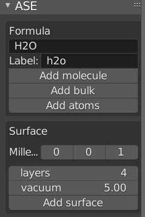
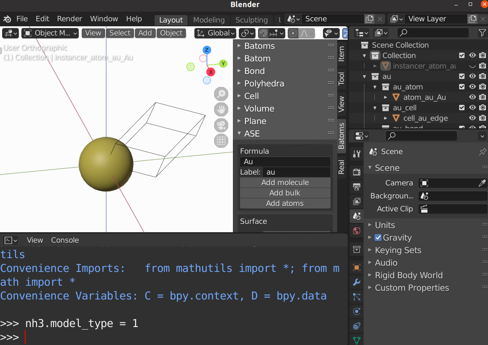
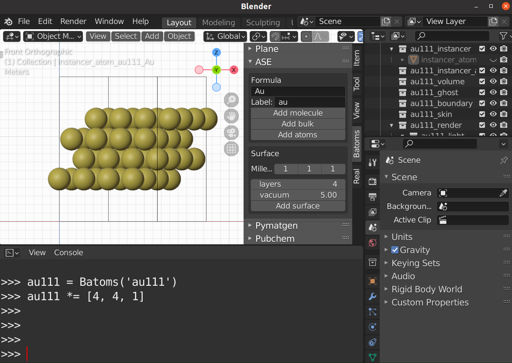

.. _gui-ase:

==============
ASE panel
==============

The ``ASE`` panel is used to build structures using the ``ase.build`` modules.

Build structure
===================
Set the formula and label, then choose which kind of structure you want to create.

Molecule
----------------------
ASE defines a number of molecular geometries in the ``g2`` database, which can be loaded directly.

.. image:: ../_static/figs/gui_ase_1.png
   :width: 20 cm

Bulk
-----------
ASE defines crystal structure and lattice constant for common elements, which can be loaded directly.

Here is an example of ``Au``. 

Surface
------------------------

To build a surface:

- select a bulk structure from the viewport, for example, the ``Au`` atoms
- set the Miller indices, number of layers and the vacuum.
- click the ``Add surface`` button.
- go to the Python console to make a supercell.

Here is an example of an ``Au(111)`` surface. 

