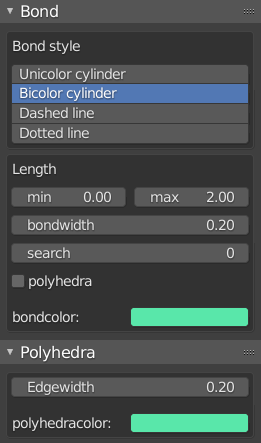

.. _gui-bond:

==============
Bond panel
==============

The ``Bond`` panel is used to set propeties related with :class:`Bondsetting` object.

``bond_style``, ``min``, ``max``, ``search``, ``polyhedra`` and ``color``.

