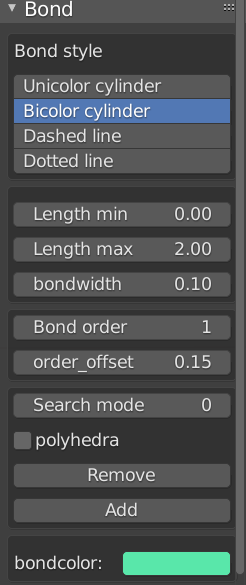

.. _gui-bond:

==============
Bond panel
==============

The ``Bond`` panel is used to set properties related with :class:`Bondsetting` object.

To change properties of bonds:

- choose a bond or several bonds from the viewport.
- select the new property in the panel.
