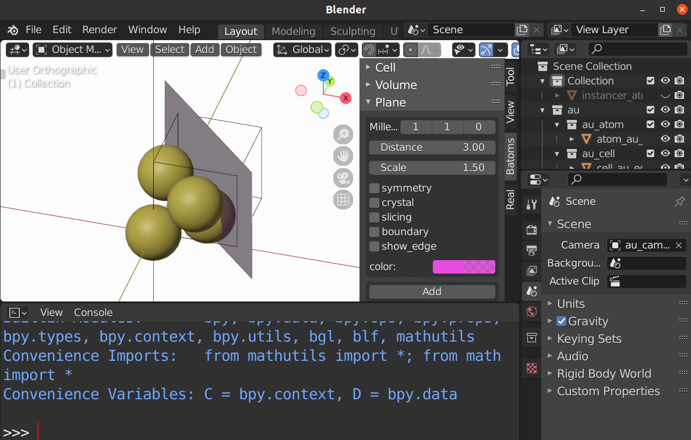

.. _gui-plane:

==============
Plane panel
==============

The ``Plane`` panel is used to set properties related with :class:`Planesetting` object.

.. image:: ../_static/figs/gui_plane.png
   :width: 5 cm
   :align: right

To change properties of plane:

- choose a plane or several planes from the viewport.
- select the new property in the panel.

Lattice plane
================

- Select the objects.
- Set the Miller indices, distance and scale
- Press the ``Add`` key.

Boundary
================

- Select the objects.
- set the Miller indices, distance and scale
- Select the ``boundary`` box
- Press the ``Add`` key.

2D slicing
================

- Select the objects.
- set the Miller indices, distance and scale
- Select the ``slicing`` box
- Press the ``Add`` key.

Crystal shape
================

- Select the objects.
- set the Miller indices, distance and scale
- Select the ``crystal`` box and the ``sysmmetry`` box.
- Press the ``Add`` key.