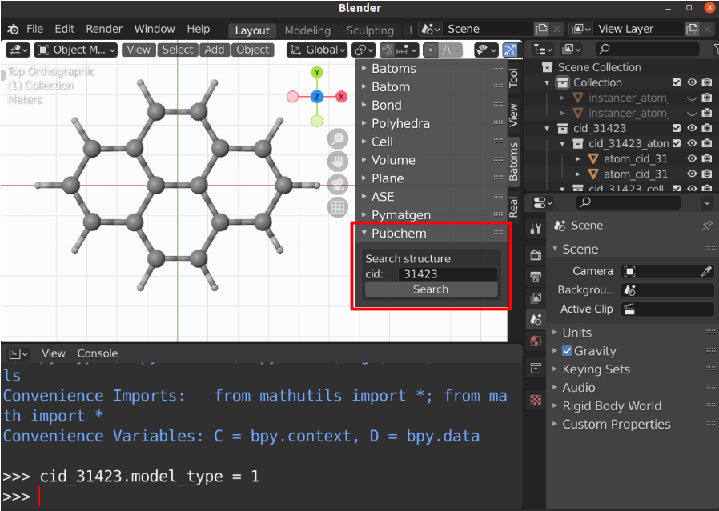

.. _gui-pubchem:

==============
Pubchem panel
==============

The ``pubchem`` panel is used to obtain compounds using the PubChem API.

.. image:: ../_static/figs/gui_pubchem.png
   :width: 5 cm
   :align: right

To load a structure from PubChem:

- Find your structure in PubChem_.
- Input the CID.
- click the ``Search`` button.
  
Example
============

Find ``pyrene`` molecule in PubChem_, 

.. image:: ../_static/figs/gui_pubchem_1.png
   :width: 10 cm

Use the CID number to load structure to Blender:

.. _PubChem: https://pubchem.ncbi.nlm.nih.gov/
