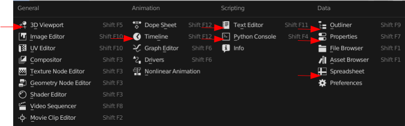
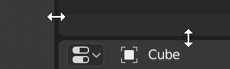
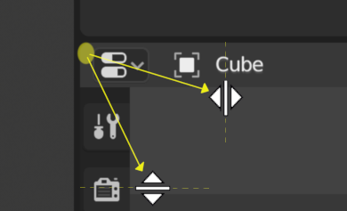

	
**************************
Introduction
**************************

.. note::

   Blender provides detailed manual online. Here we only cover the sections which are used by Beautiful Atoms.

After starting Blender and closing the :ref:`Splash Screen <splash>`
the Blender window should look something similar to the image below:

.. figure:: ../images/interface_window-system_introduction_default-startup.png
   :align: center

   The default startup Blender window.

There are four Editors in the image: 3D Viewport, Outliner, Timeline and Properties.

============
  Editors
============

Blender provides a number of different editors for displaying and modifying different aspects of data. The Editors used for Beautiful Atoms are: 

    #. 3D Viewport
    #. Timeline
    #. Text Editor
    #. Python Console
    #. Outliner
    #. Properties
    #. Asset Browser
    #. Spreadsheet

   The Editor Type selector.

Choose Editor
================

The *Editor Type* selector, the first button at the left side of a header, allows you to change the Editor in that area, it is also possible to open the same Editor type in different areas at the same time.

Resizing
========

You can resize areas of a Editor by dragging their borders with Left-Mouuse-Button (`LMB`). Move your mouse cursor over the border between two areas,
so that the cursor changes to a double-headed arrow, and then click and drag.

Splitting
=========

Splitting an area will create a new area. Placing the mouse cursor
in an area corner will change the cursor to a cross (+) to indicate that
pressing down :kbd:`LMB` will activate splitting or joining operator.
Dragging from area corner **inward** will *split* the area.
You define the split direction by dragging either horizontally or vertically.

Joining
=======

.. figure:: ../images/interface_window-system_areas_join.png
   :align: right
   :width: 250px
   :figwidth: 250px

   Properties is being joined to the Outliner.

Dragging from an area corner **outward** will *join* two areas.
The area that will be closed shows a dark overlay.
You can select which area will be closed by moving the mouse over areas.
Release the :kbd:`LMB` to complete the join.
If you press :kbd:`Esc` or :kbd:`RMB` before releasing the mouse,
the operation will be canceled.
