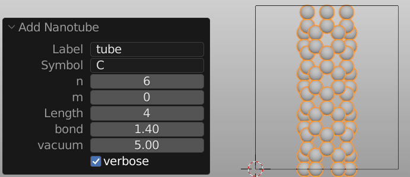
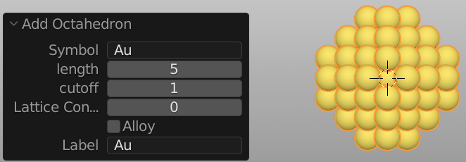

**********
Primitives
**********

.. tip::

   :Mode:      Object Mode and Edit Mode
   :Menu:      :menuselection:`Add --> Mesh`
   :Shortcut:  :kbd:`Shift-A`

Batoms comes with a number of "primitive" materials that you can start modeling from. You can add primitives in both Object and Edit Mode at the 3D cursor.

.. figure:: ../images/modeling_primitives_partiion.png

   Batoms's standard primitives.

.. note::

   A simple primitive is often used as a starting point to create even the most complex of materials.

Parameters adjustment
=======================

All the parameters can be specified in the :ref:`bpy.ops.screen.redo_last` panel, which appears when the object is created.
The parameters for each primitive will be introduced below.

.. _bpy.ops.batoms.molecule_add:

Molecule
============

The molecule is the simplest Batoms object, which is composed of atoms only. It does not has a unit cell (all zeros). It does not have periodic boundary condition in three-dimensional. Formula from the G2-database of common molecules can be used.

.. figure:: ../images/ops_batoms_molecule_add.png
   :width: 500px

   Batoms's molecule_add.
   

.. note::

   More complicated molecules may be obtained using the PubChem API integration.

.. _bpy.ops.batoms.cube_add:

Bulk
=========

A standard bulk object is composed of atoms, unit cell and periodic boundary condition in three-dimensional. The supported crystal structures are: sc, fcc, bcc, tetragonal, bct, hcp, rhombohedral, orthorhombic, mcl, diamond, zincblende, rocksalt, cesiumchloride, fluorite or wurtzite.

.. figure:: ../images/ops_batoms_bulk_add.png
   :width: 500 px

   Batoms's bulk_add.

.. note::

   More complicated crystals may be obtained using the MaterialsProject API integration.

Surface
=========

A standard surface object is composed of atoms, unit cell,  periodic boundary condition in two-dimensional and a vacuum layer in one dimensional. The supported surface structures are: 

- FCC: fcc100, fcc110, fcc111, fcc211, fcc111_root
- BCC: bcc100, bcc110, bcc111, bcc111_root
- HCP: hcp0001, hcp10m10, hcp0001_root
- Diamond: diamond100, diamond111

.. figure:: ../images/ops_batoms_surface_add.png
   :width: 500 px

   Batoms's fcc111_add.

Nanotube
===========

   Batoms's nanotube_add.

Nanoribbon
=============
Graphene ribbon.

.. figure:: ../images/ops_nano_nanoribbon_add.png
   :width: 500 px

   Batoms's nanoribbon_add.

Nanoparticle
===================
Nanoparticle: Decahedron, Icosahedron and Octahedron.

   Batoms's ops_nano_octahedron_add.

