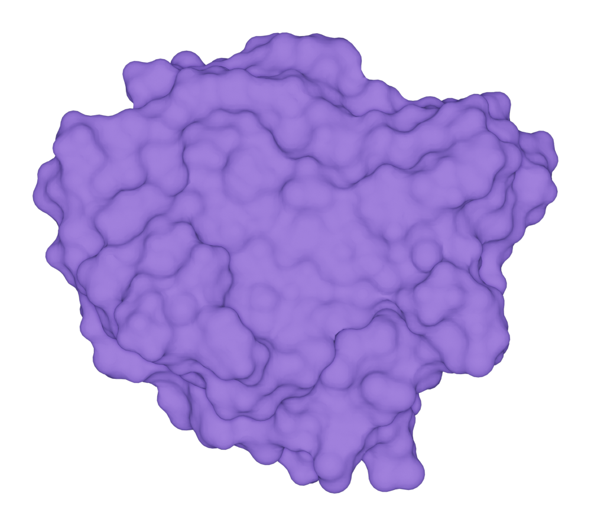

.. module:: batoms.ms.mssetting

=============================
The MSsetting object
=============================

The :class:`MSsetting` object is used to store and set all parameters related with molecular surface. Here the molecular surface includes:

    - Solvent accessible surface (SAS)
    - van der Waals surface, a special case of SAS with probe radius equal to 0)
    - Solvent-excluded surface (SES) or Connolly surface

Model
===============
There are many methods and publications for the visualization of molecular surfaces. In Batoms, two methods are used.

Meshgrid
---------------

- Find minimum box
- Build meshgrid
- Calculate power distance for grids
- Use marching cube to find isosurface

Metaball
----------------

Density from given metaball at given position is calculated by this equation in Blender:

.. math::
   
   dens = (1 - \frac{r^2}{R^2})^3 \times s

Where

r = distance from center

R = metaball radius

s - metaball stiffness

Density at given position form all metaballs is given by:

.. math::

   field = threshold - \sum_{i=0}^{N}(dens)

The isosurface then build by the BVH algorithm. 

Solvent accessible surface
===========================

Here we show a example of draw SAS for the protein kras.

>>> from ase.io import read
>>> from batoms import Batoms
>>> kras = read('test/datas/kras.pdb')
>>> kras = Batoms('kras', from_ase = kras)
>>> kras.draw_SAS(probe = 1.4, resolution = 0.4, threshold = 1e-6)
.. image:: ../_static/figs/ms_sas_kras.png
   :width: 8cm

You can get the solvent accessible surface area (SASA) by:

>>> area = kras.ms.get_sasa()[0]

Solvent-excluded surface
===========================

Here we show a example of draw SES for the protein kras.

>>> from ase.io import read
>>> from batoms import Batoms
>>> kras = read('test/datas/kras.pdb')
>>> kras = Batoms('kras', from_ase = kras)
>>> kras.draw_SES(probe = 1.4, resolution = 0.4, threshold = 1e-6)

You can get the solvent-excluded surface area (SESA) by:

>>> area = kras.ms.get_sesa()

List of all Methods
====================

.. autoclass:: MSsettings
   :members: