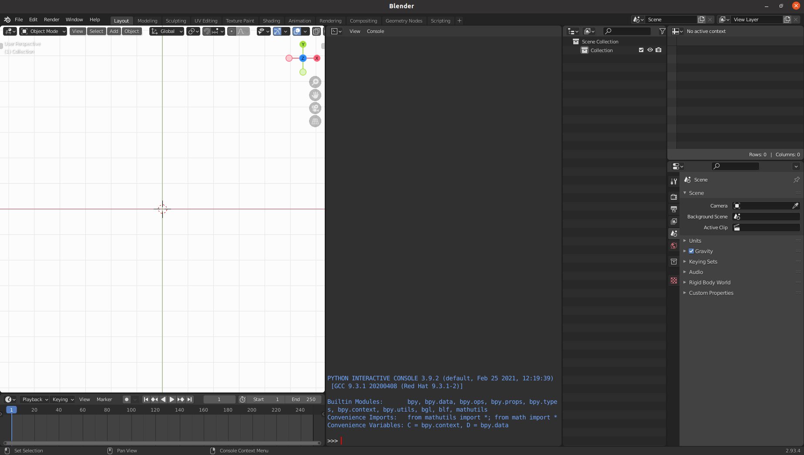

.. _tips:

=======
Tips
=======

The following setting will make manipulating more easy, thus are strongly suggested.

Save the startup file
===========================
In Blender, click on the ``File`` dropdown, ``Defaults`` and click ``Save Startup File``. This will save the entire scene for the startup. For example, delete the ``Cube``, and open a python console, then save this scene as startup. 

This is the startup scene of mine:

3-button-mouse and Numpad
==========================
For laptop without mouse, open preference panel and select:

- Emulate Numpad
- Emulate 3 Button Mouse

After that, you can:

- To rotate the view, press Alt + Left Mouse button and drag.
- To pan the view, press Shift + Alt + Left Mouse button and drag.

.. image:: _static/figs/tips_keyboard.png
   :width: 15cm

Change rotation and zoom center of viewport to selected object
===============================================================

Open preference panel and select:

- Orbit Around Selection
- Zoom to Mouse Position

.. image:: _static/figs/tips_navigation.png
   :width: 15cm

Load ``Batoms`` module on startup
=====================================

On linux, in ``/blender-2.93.4-linux-x64/2.93/scripts\modules\console_python.py``, there is some code regarding the imports / convenience variables. 

Find this line:

>>> import bpy

After the above line, add:

>>> from batoms import Batoms

Find this line:

>>> namespace["bpy"] = bpy

After the above line, add:

>>> namespace["Batoms"] = Batoms
>>> from batoms.butils import read_batoms_list
>>> items = read_batoms_list()
>>> for item in items:
      namespace[item] = Batoms(item)

This will load ``Batoms`` module and all ``Batoms`` objects on the pytohn console.

Should be similar on Windows and macOS.

The following tips are optional.

Grid setting
=======================

https://www.katsbits.com/codex/grid/

you can deselect ``Grid`` and ``Floor``.

Python
=============

.. note::

   You could avoid install inside Blender by setting bl to use system python package::

    export BLENDER_COMMAND='blender --python-use-system-env'

