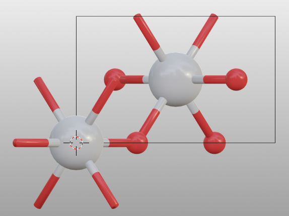
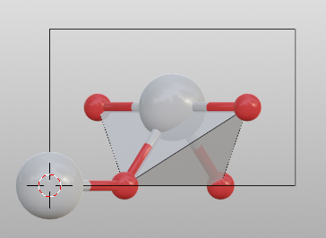
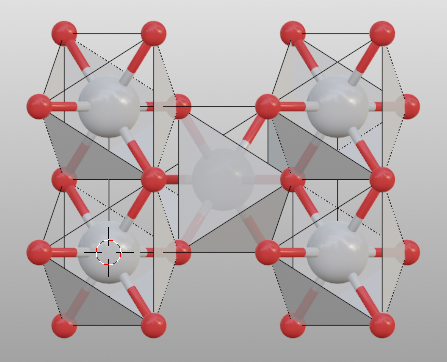
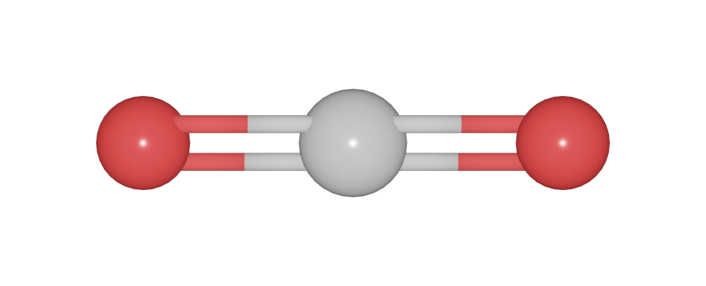

========================
Bond and Polyhedra
========================

The :mod:`Bondsettings <batoms.bonds.setting>` object controls various settings such as the bondlength and the polyhedra. 

One can set ``model_style`` to draw the bond and polyhedra.

>>> from batoms.bio import read
>>> tio2 = read("tio2.cif")
>>> tio2.model_style = 1

You can print the default bondsetting by:

>>> tio2.bonds.setting
Bondpair    min     max   Search_bond    Polyhedra style
Ti-O        0.000   2.938      1            True        1    
O-O         0.000   1.716      1            False       1    
------------------------------------------------------------

To build up coordination polyhedra, set ``model_style`` to 2. 

>>> tio2.model_style = 2
>>> # show atoms
>>> tio2.bonds.show_search = True

.. image:: ../_static/figs/bondsetting_tio2_1.png
   :width: 8cm

One can ``remove`` or ``add`` a bond pair by:

>>> tio2.bonds.setting.remove(("Ti", "O"))
>>> tio2.bonds.setting.add(("Ti", "O"))

Search bond mode
==================

* Do not search atoms beyond the boundary. The value for ``search`` should be set to 0.  

>>> tio2.bonds.setting[("Ti", "O")].search = 0
>>> tio2.boundary.update()
>>> tio2.model_style = 2

* Search additional atoms if species1 is included in the boundary, the value for ``search`` should be set to `>0`. To change setting for a bond pair by.

>>> tio2.boundary = 0.01
>>> tio2.bonds.setting[("Ti", "O")].search = 1
>>> tio2.model_style = 2
>>> # show atoms
>>> tio2.bonds.show_search = True

* Search bonded atoms of species1 or species2 recursively. This mode is the used for searching molecules.

>>> from batoms.bio import read
>>> mol = read("urea.cif")
>>> mol.boundary = 0.01
>>> mol.model_style = 1
>>> mol.bonds.show_search = True
>>> mol.get_image([1, -0.3, 0.1], engine = "eevee", output = "bondsetting_search_molecule.png")

.. image:: ../_static/figs/bondsetting_search_molecule.png
   :width: 8cm

Hydrogen bond
===================

To build up hydrogen bond for ``X-H -- Y``. Set the minimum and maximum distances of ``H-Y``, and set the ``bondlinewdith`` to a small value. Such as ``H-O`` and ``H-N`` bond.

>>> h2o.bonds.setting[("H", "O")].min = 2.0
>>> h2o.bonds.setting[("H", "O")].max = 3.0

.. image:: ../_static/figs/hydrogen-bond.png
   :width: 5cm

High order bond
=====================

One can change bond order by:

>>> from ase.build import molecule
>>> from batoms import Batoms
>>> co2 = Batoms("co2", from_ase = molecule("CO2"))
>>> co2.model_style = 1
>>> co2.bonds[0].order = 2
>>> co2.bonds[1].order = 2

Or set bond order for all ``("C", "O")`` pair:

>>> co2.bonds.setting[("C", "O")].order = 2
>>> co2.model_style = 1

