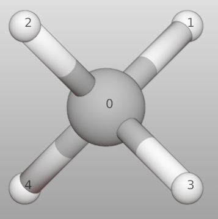
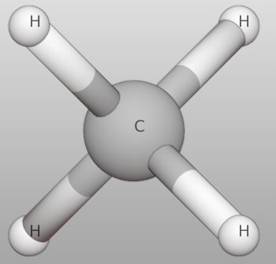
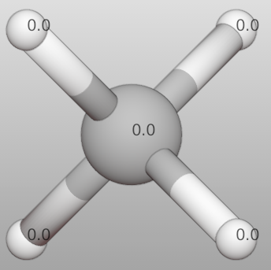

===================
Label setting
===================

Support showing label text for each atom. The label can be any attribute of batoms. Support both Edit and Object modes.

Take CH\ :sub:`4`\  molecule as a example.

>>> from ase.build import molecule
>>> from batoms import Batoms
>>> import numpy as np
>>> ch4 = Batoms('ch4', from_ase = molecule("CH4"))
>>> ch4.show_label = 'index'
>>> ch4.show_label = 'species'
>>> ch4.show_label = 'elements'
>>> ch4.set_attributes({"charges": np.zeros(5)})
>>> ch4.show_label = 'charges'

.. list-table::
   :widths: 25 25 25 25

   * -  |label0|
     -  |label1|
     -  |label2|
     -  |label3|
   * - None
     - Index
     - Species
     - Charge

.. |label0|  image:: ../_static/figs/label_ch4_none.png
   :width: 5cm

