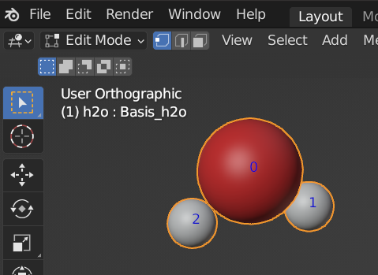

===================
Object Modes
===================

There are two modes (``Object`` and ``Edit``) which are used to manipulate atoms. In the top left corner of the 3D viewport, you can find the Mode select menu:

.. image:: ../_static/figs/object_mode-1.png
   :width: 5cm

Or you can use the hotKey: ``Tab`` key for switching between edit and object modes.

Object Mode
============== 

The default mode. To edit the object as whole, e.g. position, rotation, size.

Edit Mode
==============

To edit the elements in a object. e.g. single atom, bonds. You can enable atoms indices in the Viewport Overlays panel from the 3D viewport.

