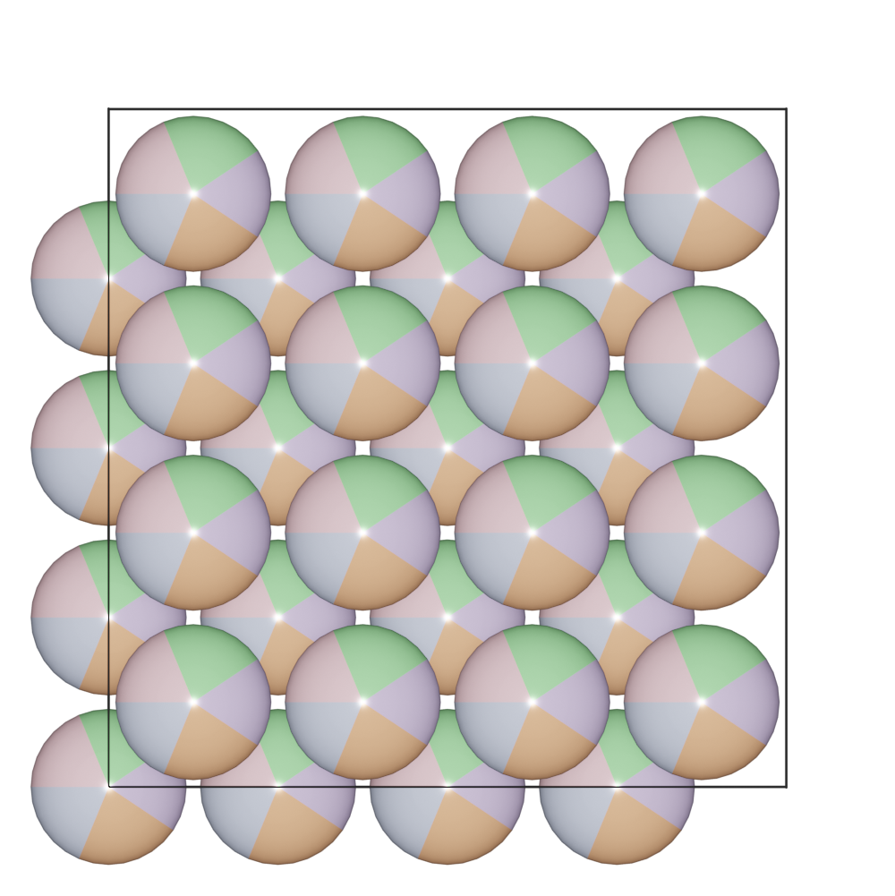

===================
Occupancy
===================

Occupancy is used for disordered site representation. A sphere with multiple color (circle graphs) is used to represent the occupancies.

.. image:: ../_static/figs/occupancy-batom.png
   :width: 3cm

The sum of all occupancies must be lower or equal to one. If the sum is lower than one, a virtual element ``X`` will be add to the species, to make the sum of all occupancies to be one.

One can change the occupancies by setting the ``species`` directly. Here is a example of a CoCrFeMnNi high-entropy alloy.

>>> from ase.build import bulk
>>> from batoms import Batoms
>>> fe = bulk('Fe', 'bcc', cubic=True)
>>> fe = Batoms(label = 'fe', from_ase = fe)
>>> fe = fe*[4, 4, 4]
>>> fe.species['Fe'] = {'elements': {'Co': 0.2, 'Cr': 0.2, 'Fe': 0.2, 'Mn': 0.2, 'Ni': 0.2}}
>>> fe.get_image(viewport = [0, 0, 1], output = 'occupancy-hea.png')

