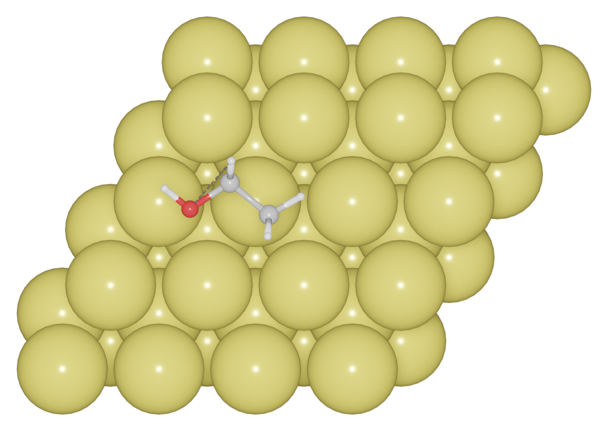
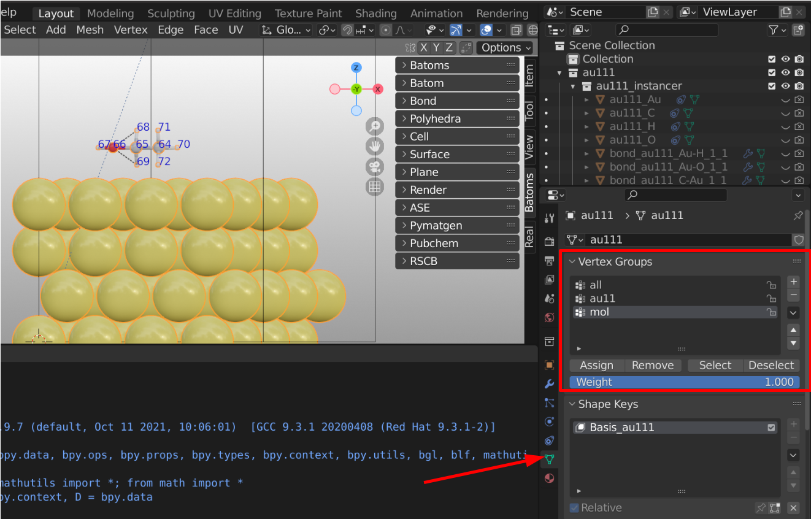

================================
Select
================================

A select is a group of atoms. The :mod:`Selects <batoms.bselect>` object controls various settings for select.

Creating a select
====================

You can create a select for the first 3 atoms by:

.. code:: python

    indices = [0, 1, 2]
    sel1 = batoms.selects.add("name", indices)

For exmaple, we have a molecule adsorbed on Au (111) surface. We can select the molecule, and change its model_style to 1.

.. code:: python

    from batoms.batoms import Batoms
    from ase.build import molecule, fcc111
    au111 = fcc111("Au", (4, 4, 4), vacuum=0)
    au111 = Batoms("au111", from_ase=au111)
    mol = Batoms("mol", from_ase=molecule("CH3CH2OH"))
    mol.translate([5, 5, 10])
    au111 = au111 + mol
    au111.cell[2, 2] += 10
    sel1 = au111.selects.add("mol", np.where(au111.arrays["species"] != "Au")[0])
    au111.selects["mol"].model_style = 1

You can select the secondary structures of a protein, and make change to them. For exmaple, show the atoms for a secondary structure by:

.. code:: python
    
    sel1 = protein.selects.add('sel1', 'sheet A-160-A-170')
    sel1.show = True
    sel1.model_style = 1

.. image:: ../_static/figs/ribbon-1ema-2.png
   :width: 8cm

Select Panel Controls
=====================

All selects are shown in the `Vertex Groups Panel`. One can use the panel directly. See the ``Vertex group`` docs. https://docs.blender.org/manual/en/latest/modeling/meshes/properties/vertex_groups/assigning_vertex_group.html

