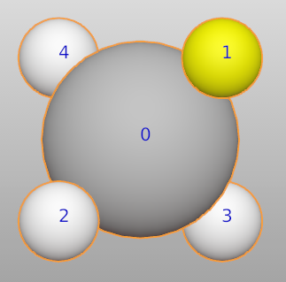

===================
Species
===================

Why do we use species instead of elements? Because some atoms are special:

* Different colors for one element.
* Different properties for one element, such as: spin up and down.
* ghost atoms: vacancy, highlight sphere, cavity
* atoms with different bondsetting

For example, we want to change the color of one hydrogen atom in CH4 molecule.

>>> from ase.build import molecule
>>> from batoms import Batoms
>>> import numpy as np
>>> ch4 = Batoms("ch4", from_ase = molecule('CH4'))

Here, we replace the first H atom with a new species ("H_1").

>>> ch4.replace([1], "H_1")
>>> ch4["H_1"].color = (1.0, 1.0, 0.0, 1.0)

Another example:

>>> from ase.build import bulk
>>> from batoms import Batoms
>>> import numpy as np
>>> au = Batoms(label = "au", from_ase = bulk('Au', cubic = True))

>>> for i in range(len(au)):
>>>     au.replace([i], "Au_%i"%i)

>>> au["Au_0"].color = [0.8, 0.8, 0.9, 1.0]
>>> au["Au_1"].color = [0.8, 0.5, 0.8, 1.0]
>>> au["Au_2"].color = [0, 0.7, 0.4, 1.0]
>>> au["Au_2"].color = [0.5, 0.1, 0.4, 1.0]

.. image:: ../_static/figs/species_au4.png
   :width: 6cm

.. note::

   Be careful, if the name of the new species does not start with "Au\_" (Au is the element to be replaced). Then, use this format:   
   
   >>> au.replace([0, 1], ["a100", {"elements":{"Au":{"occupancy":1.0}}}])

   The name should not be longer than four characters.

If you only need to change the scale of individule atoms. You can use:

>>> Au[0].scale = 2

.. image:: ../_static/figs/species_au4_2.png
   :width: 6cm