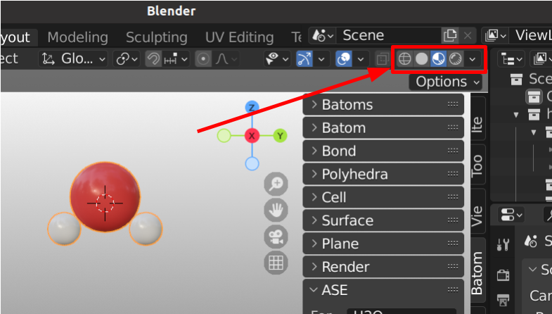

=================
Viewport
=================

One can find the settings for the viewport shading in the top right corner of the 3D viewport. These are the shading modes available from left to right:

- Wireframe
- Solid
- Material preview
- Rendered

We suggests to use ``Material preview`` shading for structure viewing and material setting. Use ``Solid`` shading for structure editing, especially for large system (> 10000 atoms). Use ``Rendered`` for lighting setup and rendering.

For each viewport shading, one can find its setting by expand the viewport shading menu.

.. image:: _static/figs/viewport_shading_menu.png
   :width: 15cm

For example, in solid shading, there are four sections:

- Lighting
- Color
- Background
- Options

For more example, please watch the following video tutorial: https://youtu.be/lc1v4jmS5b4.

